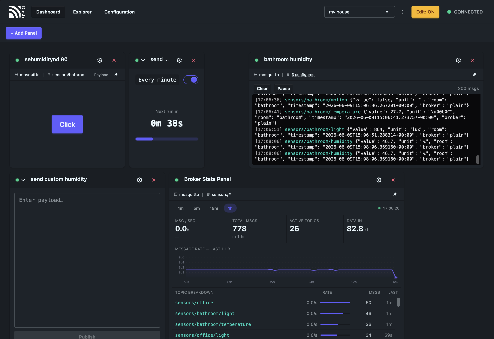
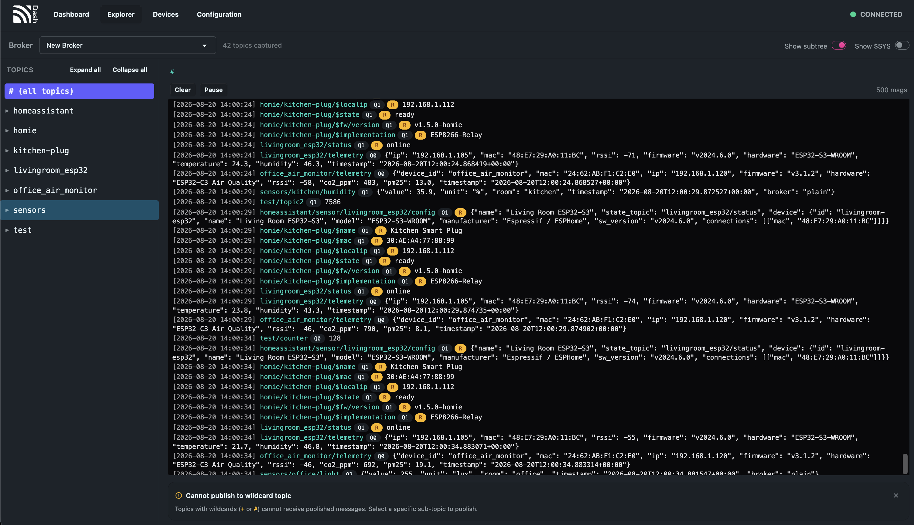
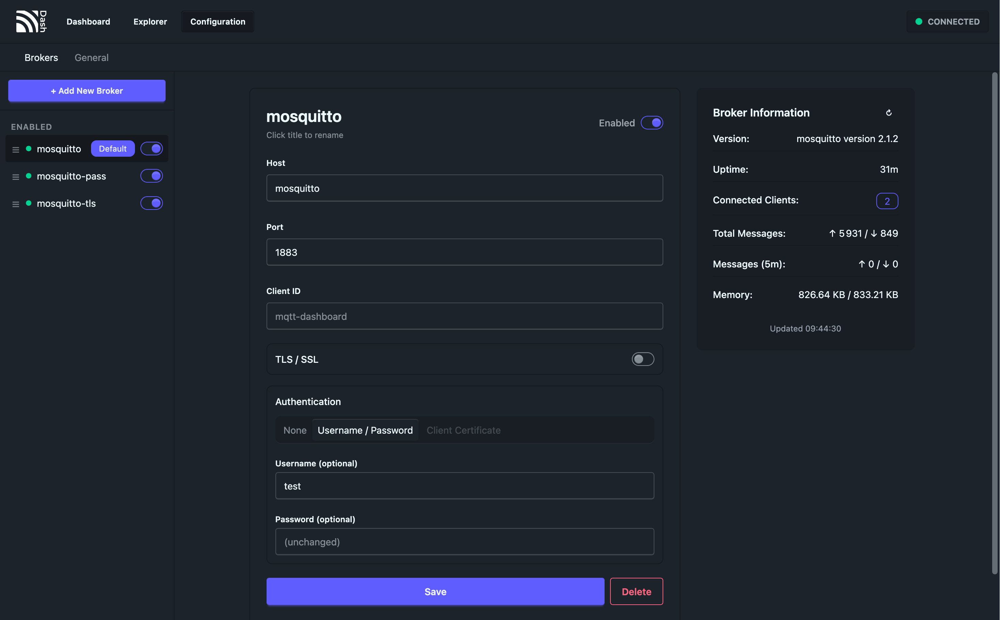

<p align="center">
  
</p>

<h1 align="center">MQTT Dashboard</h1>

<p align="center">
  <em>A self-hostable MQTT dashboard/explorer for IoT developers.</em>
</p>

<p align="center">
  <a href="https://github.com/jmischler72/mqtt-dashboard/releases"></a>
  <a href="https://github.com/jmischler72/mqtt-dashboard/pkgs/container/mqtt-dashboard"></a>
  <a href="https://github.com/jmischler72/mqtt-dashboard/blob/main/LICENSE.txt"></a>
</p>

<p align="center">
  
  
  
</p>

---

## ⭐ Features

- **Multi-Broker Support** — Connect to multiple MQTT brokers simultaneously and manage them from a single interface
- **Drag & Drop Dashboard** — Build your own control center with resizable, draggable panels using a grid layout engine
- **Topic Explorer** — Recursively browse the full topic hierarchy of your broker, inspired by MQTT Explorer
- **Message History** — Persistent history tracking with configurable data retention, viewable even after a page refresh
- **Cron Jobs** — Schedule automated MQTT publishes directly from the dashboard using a visual cron builder
- **Panel Types** — Button, Input, Log, and Cron panels to publish, monitor, and automate
- **TLS & Authentication** — Supports plain TCP, TLS/SSL, username/password, and certificate-based authentication
- **Real-Time Updates** — WebSocket-powered live message streaming
- **Broker Statistics** — View $SYS topics for broker health: clients, subscriptions, memory, throughput
- **QoS & Retain** — Full MQTT QoS (0, 1, 2) and retain flag support on publish
- **Wildcard Support** — Subscribe with `+` and `#` wildcards in log panels and explorer
- **Multiple Dashboards** — Create, rename, and switch between separate dashboard layouts
- **Single Binary** — Go backend with embedded React frontend, zero external dependencies
- **Docker Ready** — One command to deploy with persistent data volume

---

## 🔧 How to Install

### 🐳 Docker Compose (Recommended)

```yaml
services:
  mqtt-dashboard:
    image: ghcr.io/jmischler72/mqtt-dashboard:latest
    container_name: mqtt-dashboard
    ports:
      - "8080:8080"
    volumes:
      - data_volume:/app/data

volumes:
  data_volume:
```

```bash
docker compose up -d
```

MQTT Dashboard is now running at [http://localhost:8080](http://localhost:8080).

### 🐳 Docker Command

```bash
docker run -d \
  --restart=always \
  -p 8080:8080 \
  -v mqtt-dashboard-data:/app/data \
  --name mqtt-dashboard \
  ghcr.io/jmischler72/mqtt-dashboard:latest
```

### 💪 Build from Source

Requirements: Go 1.22+, Node.js 20+

```bash
git clone https://github.com/jmischler72/mqtt-dashboard.git
cd mqtt-dashboard

# Build frontend
cd frontend && npm ci && npm run build && cd ..

# Build backend (embeds frontend)
cd backend
cp -r ../frontend/dist ./dist
go build -o mqtt-dashboard .
./mqtt-dashboard
```

---

## 💡 Motivation

Existing MQTT tools are either purely client-side, lack persistence, or don't support building custom control interfaces. MQTT Dashboard combines the best of monitoring tools like MQTT Explorer with the flexibility of a customizable panel-based dashboard — all self-hosted in a single binary.

And here is the link to MQTT-Explorer that inspired a lot this project: https://github.com/thomasnordquist/MQTT-Explorer

If you find this project useful, please consider giving it a ⭐!

---

## 🏗️ Architecture

```
┌──────────────────────────┐         ┌──────────────────────┐
│   React Frontend (SPA)   │◄──WS──► │    Go Backend        │
│   Vite + Tailwind +      │◄──API─► │    Single Binary     │
│   DaisyUI                │         │                      │
└──────────────────────────┘         └──────────┬───────────┘
                                                │
                                     ┌──────────┴───────────┐
                                     │                      │
                              ┌──────▼──────┐    ┌──────────▼──────────┐
                              │   SQLite    │    │  MQTT Brokers (N)   │
                              │  (layouts,  │    │  TCP / TLS / Auth   │
                              │   configs,  │    └─────────────────────┘
                              │   history)  │
                              └─────────────┘
```

In production, the Go binary serves the embedded React build directly (so no need for the vite server :) ), it also handles API routes, WebSocket connections, and MQTT client management — all from a single port (`:8080`).

---

## 🖼️ Panel Types

| Panel      | Description                                                           |
| ---------- | --------------------------------------------------------------------- |
| **Button** | One-click publish a preset payload to a topic                         |
| **Input**  | Type and send ad-hoc messages to any topic                            |
| **Log**    | Real-time message stream with history, wildcards, and date formatting |
| **Cron**   | Scheduled automatic publishing with visual cron builder and countdown |

---

## 🛡️ Security

MQTT Dashboard supports secure broker connections out of the box:

- **TLS/SSL** encryption for broker communication
- **Username & Password** authentication
- **Client Certificate** authentication (mTLS)
- CA certificate, client cert, and client key upload via the UI

---

## 🗺️ Roadmap

- [ ] Cumulative topic view in explorer
- [ ] Configurable history toggle per broker
- [ ] Allow users to create their custom panels and share them
- [ ] More customisable options in base panels

See [TODO.md](TODO.md) and [docs/PRD/](docs/PRD/) for full details.

---

## 🛠️ Tech Stack

| Layer       | Technology                                     |
| ----------- | ---------------------------------------------- |
| Frontend    | React, Vite, TypeScript, Tailwind CSS, DaisyUI |
| Grid Engine | react-grid-layout                              |
| Backend     | Go (Golang)                                    |
| Database    | SQLite (embedded)                              |
| Scheduling  | gocron                                         |
| Realtime    | WebSocket                                      |
| Container   | Docker (Alpine)                                |

---

## 📄 License

[GPL-3.0](LICENSE.txt)

---

Thank you for checking it out ! Hope you like it. And yes the readme looks like Uptime Kuma because i like it
