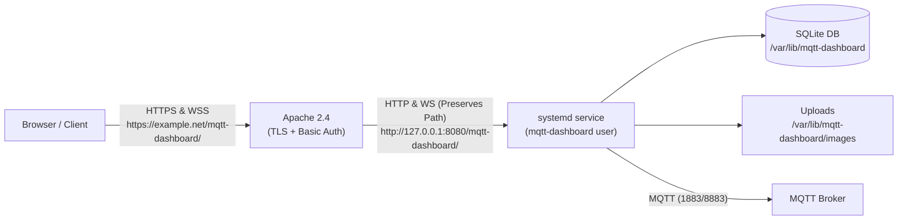

# Native Service & Apache Reverse-Proxy Deployment

This guide covers deploying MQTT Dashboard as an unprivileged system service managed by `systemd` and exposing it through an Apache reverse proxy with HTTPS, Basic Authentication, and WebSocket support at a custom sub-path (for example, `https://example.net/mqtt-dashboard/`).

---

## Architecture Overview



- **systemd**: Runs the compiled binary as an unprivileged, isolated background service bound strictly to loopback (`127.0.0.1:8080`).
- **Apache**: Manages public TLS termination, authentication, security headers, and reverse proxies HTTP, API, static assets, and WebSocket connections.
- **Path preservation**: Apache forwards requests to the application with the configured prefix `/mqtt-dashboard/` intact; stripping this prefix causes API and asset lookup failures.

---

## Part 1: systemd Service Deployment

<a id="systemd-service-deployment"></a>

This section runs the compiled MQTT Dashboard binary as an unprivileged, restartable system service. It assumes the runtime configuration described in the [README](../README.md#runtime-configuration) is in `/etc/mqtt-dashboard/config.toml`.

### 1. Create Service Account and Directories

Create a dedicated system account and persistent directories for the binary, configuration, and SQLite data:

```bash
sudo useradd --system --user-group --home-dir /var/lib/mqtt-dashboard \
  --shell /usr/sbin/nologin mqtt-dashboard
sudo install -d -o mqtt-dashboard -g mqtt-dashboard -m 0750 /var/lib/mqtt-dashboard
sudo install -d -m 0755 /etc/mqtt-dashboard
sudo install -d -m 0755 /opt/mqtt-dashboard
```

Install the compiled binary at a stable path, for example `/opt/mqtt-dashboard/mqtt-dashboard`. The service account needs read and execute permissions on the binary, and read permission on the TOML configuration file.

### 2. Configure the Application (`/etc/mqtt-dashboard/config.toml`)

Keep the dashboard bound to loopback and configure the base path that Apache will expose:

```toml
[server]
http_addr = "127.0.0.1:8080"
base_path = "/mqtt-dashboard/"

[storage]
data_dir = "/var/lib/mqtt-dashboard"

[logging]
level = "info"

# Optional: seed initial brokers or dashboards on first boot
# [seed]
# file = "/etc/mqtt-dashboard/seed.json"
```

> [!NOTE]
> `base_path` must be `/` or an absolute URL path ending in `/`. The server, REST API, WebSocket endpoint, frontend router, uploaded-image URLs, and static assets all use this value.

See the [README](../README.md#runtime-configuration) for the complete list of runtime options and their environment-variable overrides.

### 3. Create the systemd Service Unit

Create `/etc/systemd/system/mqtt-dashboard.service`:

```ini
[Unit]
Description=MQTT Dashboard
Wants=network-online.target
After=network-online.target

[Service]
Type=simple
User=mqtt-dashboard
Group=mqtt-dashboard
WorkingDirectory=/opt/mqtt-dashboard
Environment=MQTT_DASHBOARD_CONFIG=/etc/mqtt-dashboard/config.toml
ExecStart=/opt/mqtt-dashboard/mqtt-dashboard
Restart=on-failure
RestartSec=5s

# The application needs write access only to its configured data directory.
NoNewPrivileges=true
PrivateTmp=true
ProtectSystem=strict
ReadWritePaths=/var/lib/mqtt-dashboard

[Install]
WantedBy=multi-user.target
```

> [!IMPORTANT]
> The `data_dir` in TOML must match the directory allowed by `ReadWritePaths`. For the example above: `data_dir = "/var/lib/mqtt-dashboard"`.

### 4. Enable and Start the Service

```bash
sudo systemctl daemon-reload
sudo systemctl enable --now mqtt-dashboard
sudo systemctl status mqtt-dashboard
sudo journalctl -u mqtt-dashboard -f
```

> [!CAUTION]
> Before enabling the unit, stop any manually started dashboard process. Do not run two dashboard instances against the same SQLite data directory.

After changing the unit file, run `sudo systemctl daemon-reload`. After changing the TOML configuration or replacing the binary, restart the service:

```bash
sudo systemctl restart mqtt-dashboard
```

### 5. Verify the Local Backend Service

Check that the backend is responding locally on loopback before configuring the reverse proxy:

```bash
curl -fsS http://127.0.0.1:8080/mqtt-dashboard/api/health
```

It should return:

```json
{"status":"ok"}
```

---

## Part 2: Apache Reverse-Proxy Deployment

This configuration deploys MQTT Dashboard behind an Apache HTTPS virtual host at a sub-path such as `https://example.net/mqtt-dashboard/`. It is useful when the dashboard should remain private and Apache already manages TLS certificates and authentication.

### 1. Enable Required Apache Modules

Enable the necessary proxy, WebSocket, rewrite, and auth modules:

```bash
sudo a2enmod proxy proxy_http proxy_wstunnel rewrite headers auth_basic
```

### 2. Configure Virtual Host

Add the following inside your HTTPS `<VirtualHost *:443>` configuration block. The `ProxyPass` destination must **preserve** `/mqtt-dashboard/`; stripping it would make the configured backend routes unavailable.

```apache
# Canonical trailing slash for the SPA base path.
RedirectMatch 301 ^/mqtt-dashboard$ /mqtt-dashboard/

# Forward WebSocket upgrades while retaining the application prefix.
RewriteEngine On
RewriteCond %{HTTP:Connection} Upgrade [NC]
RewriteCond %{HTTP:Upgrade} websocket [NC]
RewriteRule ^/mqtt-dashboard/(.*)$ ws://127.0.0.1:8080/mqtt-dashboard/$1 [P,L]

# HTTP, API, static assets, and the SPA routes.
ProxyPass        /mqtt-dashboard/ http://127.0.0.1:8080/mqtt-dashboard/
ProxyPassReverse /mqtt-dashboard/ http://127.0.0.1:8080/mqtt-dashboard/

<Location /mqtt-dashboard/>
    AuthType Basic
    AuthName "MQTT Dashboard"
    AuthUserFile /etc/apache2/.htpasswd-mqtt-dashboard
    Require valid-user

    Header always set X-Robots-Tag "noindex, nofollow, noarchive, nosnippet"
</Location>
```

### 3. Set Up Basic Authentication

Create the password file when it does not already exist:

```bash
sudo htpasswd -c /etc/apache2/.htpasswd-mqtt-dashboard YOUR_USER
```

For subsequent users, omit `-c` so the existing password file is not overwritten.

### 4. Validate and Reload Apache

Validate the configuration and reload the service:

```bash
sudo apachectl configtest
sudo systemctl reload apache2
```

---

## Verification & Troubleshooting

### Browser Developer Tools Verification

1. Open `https://example.net/mqtt-dashboard/` in your browser and log in with your Basic Auth credentials.
2. In the browser developer tools (Network tab), check requests for `assets/*.js` and `assets/*.css`:
   - They must return the actual JavaScript/CSS asset content with status `200 OK`, **not** HTML `index.html`.
   - A tiny JavaScript or CSS response containing HTML content usually means Apache removed the prefix before forwarding, or that an older binary without base-path asset handling is still running.

### Expected Backend Logs

The dashboard log (`sudo journalctl -u mqtt-dashboard -f`) should show requests including the prefix:

```text
GET /mqtt-dashboard/api/health
GET /mqtt-dashboard/assets/index-....js
GET /mqtt-dashboard/ws
```

### Security Checklist

- **Keep loopback binding**: Keep the service bound to `127.0.0.1` unless it is intentionally exposed by another firewall or proxy arrangement. Apache should be the only public entry point.
- **WebSocket Upgrade order**: Ensure the `RewriteRule ... ws://...` rule appears *before* `ProxyPass` so WebSocket connection upgrades are handled by `mod_proxy_wstunnel`.

### Common Issues

| Symptom | Cause | Solution |
| :--- | :--- | :--- |
| **`404 Not Found` on assets or API** | Sub-path stripped in `ProxyPass` | Ensure destination URL is `http://127.0.0.1:8080/mqtt-dashboard/` (with trailing slash). |
| **Asset returns HTML (`index.html`)** | Trailing slash missing on initial URL | Ensure `RedirectMatch 301 ^/mqtt-dashboard$ /mqtt-dashboard/` is enabled. |
| **WebSocket disconnects or polling fallback** | `mod_proxy_wstunnel` or rewrite rule missing | Ensure `a2enmod proxy_wstunnel` was run and the `RewriteRule` is active. |
| **Database write permission denied** | systemd sandboxing mismatch | Ensure `data_dir` in TOML matches `ReadWritePaths` in `/etc/systemd/system/mqtt-dashboard.service`. |
